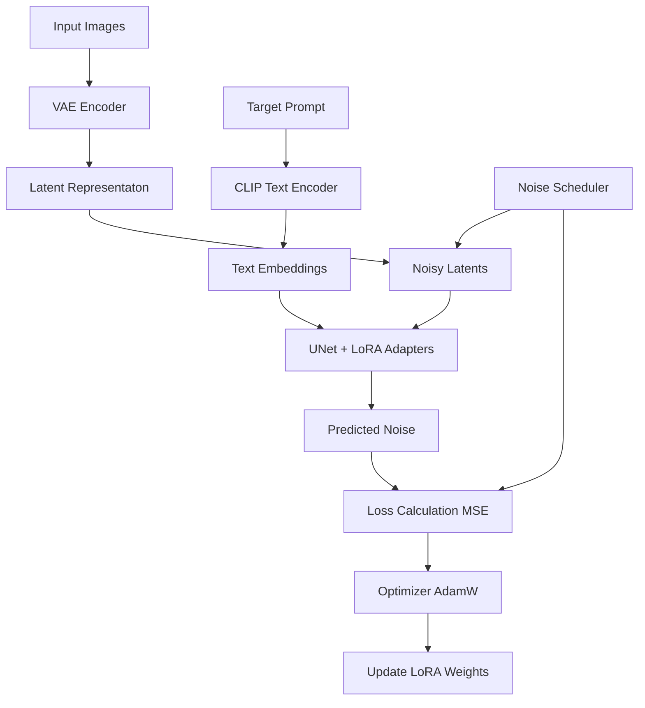
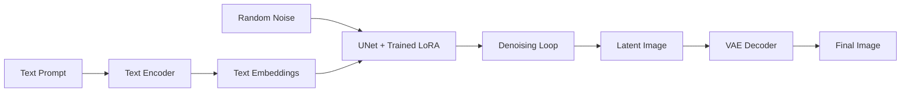

# Project Workflow

This document describes the technical steps involved in fine-tuning Stable Diffusion with LoRA.

## Training Workflow

## Inference Workflow

## Detailed Steps

1. **VAE Encoding**: The input images are resized to 512x512 and passed through the VAE encoder to obtain 64x64 latent representations. This reduces computational cost as we operate in a smaller space.
2. **Noise Injection**: We sample a random timestep and add Gaussian noise to the latents according to the scheduler's schedule.
3. **UNet Prediction**: The UNet (augmented with LoRA layers) tries to predict the added noise, conditioned on the text embeddings of the concept ("Cheburashka").
4. **LoRA Update**: Only the small LoRA adapter weights are updated, while the base model weights are frozen.
5. **Denoising (Inference)**: Starting from pure noise, the UNet iteratively removes noise guided by the text prompt and the learned LoRA weights.
